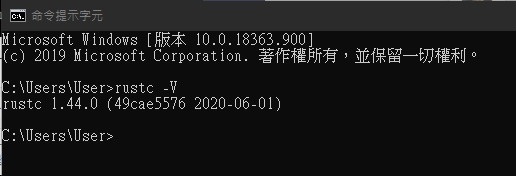
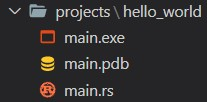
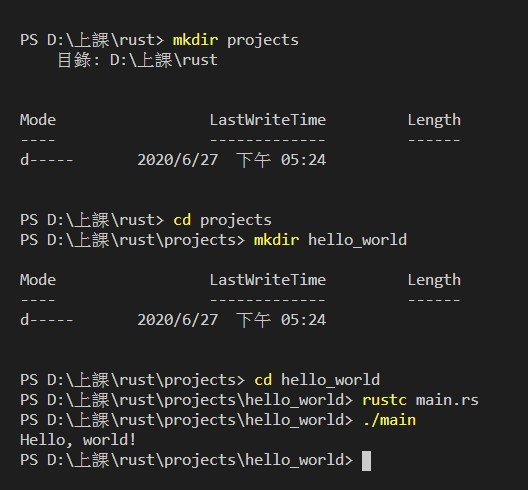
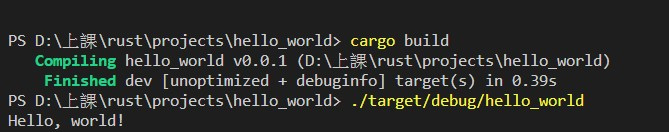

# 安裝rust 
安裝完後，可以使用rustc -V 來確認是否安裝成功，並檢查版本。

# 開始
當有`!`時代表調用的是巨集，並不是普通函數。<br>
1.`println!`此為調用巨集。<br>
2.`println` 是調用普通函數。<br>
3.`$ rustc main.rs`類似C和C++的`gcc`，並且使用`.\`執行。
***
# hello world
在我執行rust程式前，我需要先用`rustc main.rs`來編譯他，會產生以下的檔案，這和C語言的`gcc`很相似


****
# 輸出
在以下範例中，可以發現rust並不像C語言，使用 % 加上英文字母來做為占位符，而是使用{}。
```
C語言範例

mian(){
    int a =12;
    printf("a is %d" , a);
}
```
使用let來定義一個不可變的變量，如果使用let mut可以使a成為一個可變的變量。
```
RUST範例

fn main() {
    let a = 12;
    println!("a is {}", a);
}
```
這代表著a是一個無號64位整數的變量，如果沒有宣告，則會自動判斷為有號32位整數變量，這樣會對a的取值範圍有很大的影響。
```
let a: u64 = 123;
```
# 重影（Shadowing）
這是一個跟之前學C語言不同的概念，但是看起來和js有一定的相似度。因為有了重影，所以可以讓我重新使用相同的變量名稱。
```
fn main() {
    let x = 5;
    let x = x + 1;
    let x = x * 2;
    println!("The value of x is: {}", x);
}
執行結果為
```
PS D:\上課\rust\shadowing\shadowing\target> cargo run
   Compiling shadowing v0.1.0 (D:\上課\rust\shadowing\shadowing)
    Finished dev [unoptimized + debuginfo] target(s) in 0.39s
     Running `debug\shadowing.exe`
The value of x is: 12
```


執行結果為:

The value of x is: 12
```
可以看出我可以用 `let`來隱藏住我的變數，使他可以不斷的往下算。
# 數據類型
用( ) 包括一組數據，而且可以包含不同種類的數據：
```
let tup: (i32, f64, u8) = (500, 6.4, 1);
// tup.0 = 500
// tup.1 = 6.4
// tup.2 = 1
let (x, y, z) = tup;
// y = 6.4
```
用 [ ] 包括的同類型的數據。
```
let a = [1, 2, 3, 4, 5];
// a = 長度為5的整數數組

let b = ["January", "February", "March"];
// b = 長度為 3 的字符串數組
let c: [i32; 5] = [1, 2, 3, 4, 5];
// c = 長度為 5 的 i32 數組

let d = [3; 5];
// 等於 let d = [3, 3, 3, 3, 3];

let first = a[0];
let second = a[1];
// 數組訪問

a[0] = 123; // 錯誤：數組 a 不可變
let mut a = [1, 2, 3];
a[0] = 4; // 正確
```
範例取自:https://www.runoob.com/rust/rust-data-types.html

# 陣列
每個語言都有陣列，RUST當然也不例外。<br>
這是最基本的陣列，一個固定大小、有相同型別的元素清單。 陣列預設是不可變的。

```
let a = [1, 2, 3]; // a: [i32; 3]
let mut m = [1, 2, 3]; // m: [i32; 3]
```

有一個可以初始化陣列中所有元素為同一個值的簡寫。 在以下範例，所有 a 中的元素將被初始化為 0：
```
let a = [0; 20]; // a: [i32; 20]
```


# cargo

剛開始在用`rustc`寫`hello world`的時我覺得cargo是多餘的東西，後來才發現當我在用比較複雜的專案時，我只需要執行`cargo build`，然後一切都會正確的運行，所以才開始覺得cargo很方便，因此以下來做cargo的小介紹。

### 當我想要把專案cargo化時，需要做3件事。
1. 把原始碼放到正確的目錄
2. 去除舊的執行檔，建一個新的
3. 建立 Cargo 配置檔

#### 建立配置檔
新建一個檔案並命名為Cargo.toml。<br>
並且Cargo.toml 的C一定要大寫，否則 Cargo 會無法處理這樣的配置。<br>
而且這個檔案使用 TOML（Tom's Obvious, Minimal Language）格式。 TOML 跟 INI 很類似，但是有一些額外的好處，且被用來作為 Cargo 的配置格式。<br>
```
[package] 

name = "hello_world"
version = "0.0.1"
authors = [ "<example>" ]
```
第一行的[package] 代表以下的陳述是用來配置一個套件（package）<br>
後面三行設定了三項 Cargo 在編譯程式時所需知道的配置：程式的名字、版本、和作者。<br>
#### 在建完配置檔之後，就是建立和執行cargo專案的時候了


我可以用 cargo build 建置專案、並透過 ./target/debug/hello_world 執行它，也可以直接用 cargo run 一次就執行兩者：
```
PS D:\上課\rust\projects\hello_world> cargo run
    Finished dev [unoptimized + debuginfo] target(s) in 0.01s
     Running `target\debug\hello_world.exe`
Hello, world!
```
### What is Cargo.lock?
當我使用了cargo build後，產生了這麼一個檔案，後來去查了一下才知道原來Cargo 使用 Cargo.lock 去追蹤應用程式的 dependencies。這是 Hello World 專案的 Cargo.lock 檔。 因為此專案沒有任何 dependencies，所以檔案有點稀疏。 實際上，你不需要自己去碰這個檔案；你只要讓 Cargo 去處理就好了。"引用<a href="https://askeing.github.io/rust-book/getting-started.html#%E5%BB%BA%E7%AB%8B%E5%B0%88%E6%A1%88%E6%AA%94">這裡</a>的內容"

### 開始我的cargo
輸入cargo new 可開始一個新專案
`cargo new hello_world --bin`
其中加入了 `--bin` 指令，這樣可以建立一個可執行的應用程式，然後Cargo 會產生兩個檔案和一個目錄給我們：Cargo.toml 檔案，src 目錄、和 src 下的 main.rs 檔案。 它們看起來與前面手動建立的結構很像，並根據我給它的參數和你的 git 環境配置產生帶有預設值的Cargo.toml。

## 心得
剛開始要做這個學習的時候，還很忐忑，因為沒有聽過這個語言，而且感覺會很難，但是真正開始學之後，發現和大部分的程式語言都是有一定的相似度，只有些許的概念和想法有點不同而已，雖然並沒有非常深入研究rust但是在一些比較基本的東西上，我認為還是有能力可以做出來的，因此我預計在暑假期間，可以再稍微深入地來理解一下rust，來讓我會更多的程式語言。